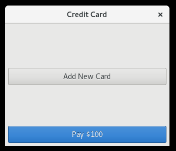
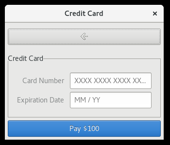
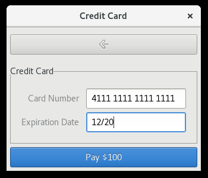
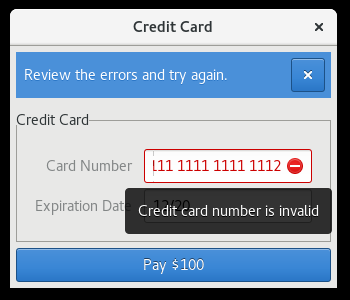
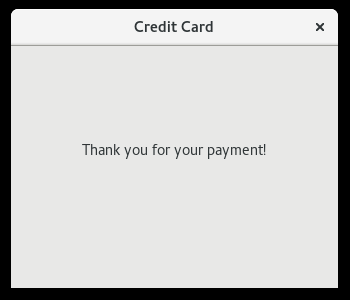

# GTK+ Payments Widget

This repository contains a custom credit card form widget, backed by
[Braintree](https://www.braintreepayments.com/)'s APIs. Check out the following
screenshots for what it looks like:

## Screenshots

Click the button to add a new card; existing payment methods would show up
here.

The simplest configuration takes just a credit card number and expiration
date, but additional fields (like CVV) can be supported depending on how you've
configured your gateway.

Errors are shown as tooltips on the relevant field.

Once the information is accepted, the widget clears to a thank you message.

